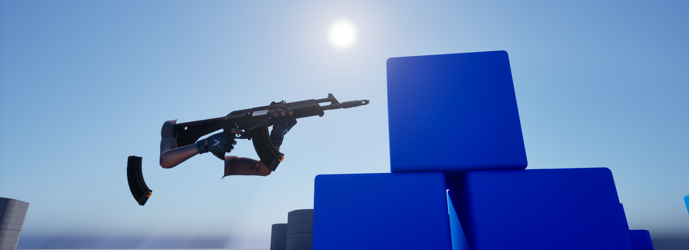

### Valorant Mechanics (WIP)

Recreating some FPS games' mechanics in Unreal Engine 5.7.

The initial vision of the project was to create certain gameplay elements from VALORANT. However now, the project may include parts resembling the polished game of both VALORANT and CS2.

### Legal

This project is inspired by VALORANT and other FPS games, including Counter-Strike 2.

The repository contains original code and does not redistribute proprietary assets belonging to Riot Games, Inc., Valve Corporation, or other third parties. Parts of the commit history may contain such assets, which have since been removed. Any assets used during development are kept locally and are *not* redistributed.

Asset structure and layout may be documented where applicable. Users wishing to rebuild the project must provide their own assets.

For legal inquiries, contact: [swaroopshri2019@gmail.com](mailto:swaroopshri2019@gmail.com)

